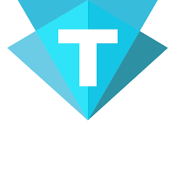
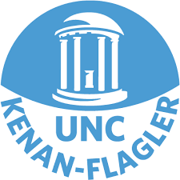

# Hi, I'm Mitchell.

I've had a wider breadth of experiences than I expected to have at this point in my life. I studied physics, got an accounting degree, did public accounting, then did private accounting, and now I'm getting certified in web development. Admittedly, it's taken longer to land in an industry I enjoy than I expected it too. That being said, I've found my home in web development and software engineering. My love of data, engineering, abstraction, design, and user experience all exist symbiotically in this space together.

---

### Education

|                                                                          | University                                  | Degree                                    | Highlights              |
| ------------------------------------------------------------------------ | ------------------------------------------- | ----------------------------------------- | ----------------------- |
|  | Trilogy Bootcamp (UNC-CH)                   | Full Stack Web Developement Certification |                         |
|       | Kenan Flagler Business School (UNC-CH)      | Masters of Accounting                     |                         |
|      | University of North Carolina at Chapel Hill | BS in Physics                             | SKYNET Research Scholar |

---

### Experience

|                                                                                                                                                   | Company              | Position         | Office            |
| ------------------------------------------------------------------------------------------------------------------------------------------------- | -------------------- | ---------------- | ----------------- |
|  | Kymera International | Staff Accountant | Raleigh, NC       |
|     | EY                   | Audit Associate  | San Francisco, CA |

---

### <a href="https://mitchellmunderwood.github.io/Responsive_Portfolio/">Check out my portfolio</a> to see some of the recent projects I've been working on.

---

